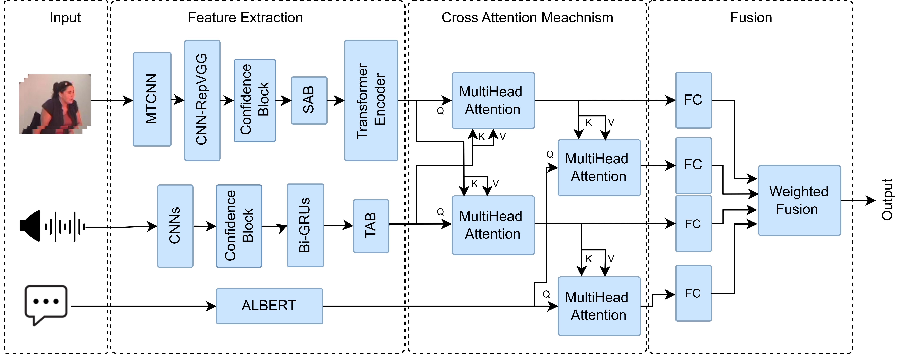
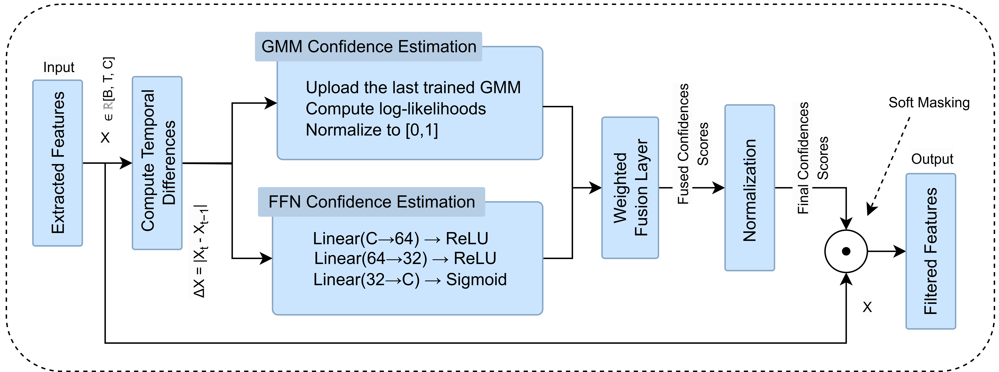
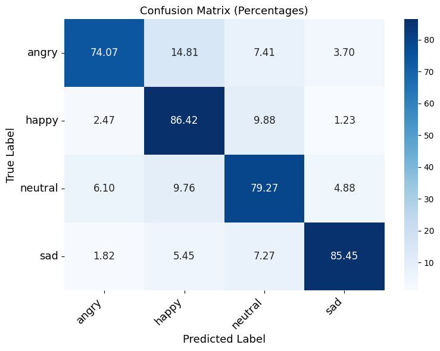

<!-- PROJECT LOGO -->
<br />
<div id="readme-top" align="center">
  <a href="https://github.com/InesJemmali/Confidence-Aware-Feature-Selection-for-Robust-MMER-in-Mental-Health-Monitoring">
    
  </a>

  # CAFES: Confidence-Aware Feature Enhancement and Selection for Robust Multimodal Emotion Recognition in Mental Health Monitoring

  <p align="center">
    CAFES: Confidence-Aware Feature Enhancement and Selection for Robust Multimodal Emotion Recognition in Mental Health Monitoring
    <br />
    <strong>This paper has been submitted for publication.</strong>
    <br />
  </p>
</div>

<div align="center">

[](https://github.com/InesJemmali/Confidence-Aware-Feature-Selection-for-Robust-MMER-in-Mental-Health-Monitoring/#readme "Go to project documentation")

</div>  

<div align="center">
    <p align="center">
    ·
    <a href="https://github.com/InesJemmali/Confidence-Aware-Feature-Selection-for-Robust-MMER-in-Mental-Health-Monitoring/issues">Report Bug</a>
    ·
    <a href="https://github.com/InesJemmali/Confidence-Aware-Feature-Selection-for-Robust-MMER-in-Mental-Health-Monitoring/issues">Request Feature</a>
  </p>
</div>

---

## Overview

This repository contains the implementation of **CAFES**, a **multimodal emotion recognition (MMER) system** designed for mental health monitoring. It is based on the paper:

> *"CAFES: Confidence-Aware Feature Enhancement and Selection for Robust Multimodal Emotion Recognition in Mental Health Monitoring."*

### Key Features:
- **Modality-Specific Encoders:** Tailored neural architectures for each modality (CNN-BiGRU for audio, RepVGG+Transformer for video, and ALBERT for text).
- **Confidence-Aware Feature Filtering:** Combines supervised (FFN) and unsupervised (GMM) confidence scores to attenuate noisy or irrelevant features, while salient features.
- **Modality Fusion:** Two-stage attention mechanism to fuse multimodal information with text guidance. For the final decision fusion, a learnable weighting layer.
- **Final Fusion** Learnable weighting scheme for final decision fusion.
- **Composite Loss Function:** Combines focal loss with a confidence-alignment regularization objective.

---

## Contents
<details>
  <summary>Table of Contents</summary>
  <ol>
    <li><a href="#abstract">Abstract</a></li>
    <li><a href="#built-with">Built With</a></li>
    <li><a href="#datasets">Dataset</a></li>
    <li><a href="#evaluation-metrics">Evaluation Metrics</a></li>
    <li><a href="#experimental-results">Experimental Results</a></li>
    <li><a href="#comparison-with-state-of-the-art">Comparison with State-of-the-Art</a></li>
    <li><a href="#installation">Installation</a></li>
    <li><a href="#usage">Usage</a></li>
    <li><a href="#project-structure">Project Structure</a></li>
    <li><a href="#paper-reference">Paper Reference</a></li>
    <li><a href="#license">License</a></li>
    <li><a href="#contact">Contact</a></li>
  </ol>
</details>

---

## Abstract

This work presents a confidence-aware framework for multimodal emotion recognition, designed to enhance robustness in real-world mental health monitoring. The system filters unreliable audio and visual features using frame-level and channel-wise confidence scores estimated through a supervised FFN and an unsupervised GMM. A learnable fusion mechanism integrates these scores, while a confidence-alignment loss reinforces consistency. A two-stage attention-based fusion strategy first captures audio-visual interactions, then applies text-guided attention. Evaluated on IEMOCAP and CMU-MOSEI, the model achieves state-of-the-art performance with 90.81% accuracy and 81.69% F1-score on IEMOCAP, and strong generalization on CMU-MOSEI with 73.48% accuracy and 63.48% F1-score.

## Model Components

### Text Modality
- **Encoder**: Pre-trained ALBERT model  
- **Purpose**: Provides stable and semantically rich representations for emotion understanding

### Audio Modality
- **Encoder**: 1D CNN + BiGRU
- **Confidence Estimation**:  
  - **FFN** trained on temporal deltas (local confidence)  
  - **GMM** trained per epoch (global consistency)  
  - Scores fused via learnable layer and applied before temporal modeling  
  - Soft selection applied before temporal modeling  
- **Temporal Attention**: **TAB** (Temporal Attention Block) to enhance salient temporal dim

### Video Modality
- **Face Detection**: MTCNN  
- **Spatial Encoder**: RepVGG-based CNN  
- **Spatial Attention**: SAB (Spatial Attention Block) to enhance salient spatial dim
- **Confidence Estimation**:  
  - FFN and GMM as in audio modality  
  - Soft selection applied before temporal modeling  
- **Temporal Modeling**: Transformer Encoder 

### Fusion
- **Stage 1**: 2 Cross-attentions between audio and video  
- **Stage 2**: Text as query to attend to audio-video representations  
- **Fusion**: Weighted late fusion over four outputs


<p align="right">(<a href="#readme-top">back to top</a>)</p>

---

## Built With

### Tools and Libraries

- 
- 
- 
- 
- 
- 

<p align="right">(<a href="#readme-top">back to top</a>)</p>

---

## Architecture of the Model : CAFES

<p align="center">
  
</p>

<p align="right">(<a href="#readme-top">back to top</a>)</p>

## Architecture of the confidence-aware feature filtering 

<p align="center">
  
</p>

<p align="right">(<a href="#readme-top">back to top</a>)</p>

---

## Datasets

The model is evaluated on two benchmark datasets: **IEMOCAP** and **CMU-MOSEI**, both widely used for multimodal emotion recognition.


Processed data for dataset can be downloaded from:
[Download Processed Data](https://hkustconnect-my.sharepoint.com/personal/wdaiai_connect_ust_hk/_layouts/15/onedrive.aspx?id=%2Fpersonal%2Fwdaiai_connect_ust_hk%2FDocuments%2FMME2E%2Fdata%2Ezip&parent=%2Fpersonal%2Fwdaiai_connect_ust_hk%2FDocuments%2FMME2E&ga=1)

<p align="right">(<a href="#readme-top">back to top</a>)</p>

---

## Evaluation Metrics

To guarantee robust performance across all emotion categories, the model's effectiveness is evaluated using both  **accuracy** and **F1-score**.

---

## Experimental Results

### IEMOCAP Dataset

**Table 1:** Performance on IEMOCAP (Accuracy, Precision, Recall, F1-score)  


| Emotion | Accuracy | Precision | Recall | F1-score |
|---------|----------|-----------|--------|----------|
| Angry   | 91.91%   | 83.33%    | 74.07% | 78.43%   |
| Happy   | 88.97%   | 78.65%    | 86.42% | 82.35%   |
| Neutral | 87.87%   | 80.25%    | 79.27% | 79.75%   |
| Sad     | 94.49%   | 87.04%    | 85.45% | 86.24%   |
| **Avg** | **90.81%** | **82.32%** | **81.30%** | **81.69%** |


### CMU-MOSEI Dataset

**Table 2:** Performance on CMO-MOSEI (Accuracy, Precision, Recall, F1-score) 

| Emotion  | Accuracy | Precision | Recall | F1-score |
|----------|----------|-----------|--------|----------|
| Angry    | 75.62%   | 66.67%    | 65.12% | 65.88%   |
| Disgust  | 76.67%   | 75.00%    | 75.56% | 75.28%   |
| Fear     | 73.55%   | 66.67%    | 53.57% | 59.41%   |
| Happy    | 73.36%   | 47.22%    | 72.86% | 57.30%   |
| Sad      | 68.62%   | 62.35%    | 54.08% | 57.92%   |
| Surprise | 73.03%   | 60.87%    | 70.00% | 65.12%   |
| **Avg**  | **73.48%** | **63.13%** | **65.20%** | **63.48%** |


#### Confusion Matrix

<p align="center">
  
</p>

<p align="right">(<a href="#readme-top">back to top</a>)</p>


---

## Comparison with State-of-the-Art

### IEMOCAP Dataset

**Table 3:** Comparison with SOTA Methods on IEMOCAP  

| Method                | Accuracy  | Precision | Recall | F1-score  |
| --------------------- | --------- | --------- | ------ | --------- |
| M3ER (2020)            | 82.7      | NA        | NA     | 82.4      |
| NORM-TR (2022)       | 84.3      | NA        | NA     | 84.5      |
| LMR-CBT (2023)        | 82.73     | NA        | NA     | 81.48     |
| Babaali et al. (2023)  | 75.42     | 76.1      | 75.42  | 75.35     |
| Hosseini et al. (2024) | 82.9      | NA        | NA     | NA        |
| Majumder et al. (2018) | 76.5      | NA        | NA     | 76.8      |
| **CAFES (Ours)**      | **90.81** | 82.32     | 81.30  | **81.69** |


### CMU-MOSEI Dataset

**Table 4:** Comparison with SOTA Methods on CMU-MOSEI

| Method                    | Accuracy  | F1-score  |
| ------------------------- | --------- | --------- |
| Zadeh et al.  (2018)      | 62.35     | 76.33     |
| Akhtar et al. (SLT, 2021) | 61.30     | 76.20     |
| Akhtar et al. (MLT, 2021) | 62.80     | 78.60     |
| Le et al. (2023)         | 67.80     | 47.60     |
| Dai et al.  (2021)         | 66.80     | 46.80     |
| Wei et al. (2023)          | 73.40     | 47.48     |
| **CAFES (Ours)**          | **73.48** | **63.48** |


<p align="right">(<a href="#readme-top">back to top</a>)</p>


---

## Installation

1. **Clone** this repo:
   ```bash
   git clone https://github.com/InesJemmali/Confidence-Aware-Feature-Selection-for-Robust-MMER-in-Mental-Health-Monitoring.git
   cd Confidence-Aware-Feature-Selection-for-Robust-MMER-in-Mental-Health-Monitoring
   ```
2. **Install dependencies**:
   ```bash
   pip install -r requirements.txt
   ```

<p align="right">(<a href="#readme-top">back to top</a>)</p>

---

## Usage

1. **Configure dataset paths** in `main.py`.
2. **Train the model**:
   ```bash
   python main.py
   ```
3. **Evaluate on test set**:
   ```bash
   python main.py --test
   ```

<p align="right">(<a href="#readme-top">back to top</a>)</p>

---

## Project Structure

```
mmer/
├── figures/                  # Visualization assets
│   ├── confusion_matrix.png
│   ├── logo.png
│   └── model_archi1.png
├── CAFES/                      # Source code directory
│   ├── models/
│   │   ├── audio_model.py
│   │   ├── text_model.py
│   │   ├── video_model.py
│   │   ├── gmm.py
│   │   ├── confidences.py
│   │   ├── transformers_module.py
│   │   ├── mmer.py
│   │   └── attention_module.py
│   ├── trainers/
│   │   └── trainer_definitions.py
│   ├── utils/
│   │   ├── data_utils.py
│   │   ├── evaluations.py
│       └── loss_functions.py
├── .gitignore               # Git ignore file
├── datasetiemocap.ipynb
├── datasetmosei.ipynb
├── LICENSE
├── main.py                  # Main entry point
├── README.md
└── requirements.txt         # Dependencies
```

<p align="right">(<a href="#readme-top">back to top</a>)</p>

---

## Paper Reference

If you utilize this code, please cite:

> "CAFES: Confidence-Aware Feature Enhancement and Selection for Robust Multimodal Emotion Recognition in Mental Health Monitoring."

<p align="right">(<a href="#readme-top">back to top</a>)</p>

---

## Steps to train the Model

1. **Install Git** (if not already installed).
2. **Clone the Repository**:
   ```bash
   git clone https://github.com/InesJemmali/Confidence-Aware-Feature-Selection-for-Robust-MMER-in-Mental-Health-Monitoring.git
   cd Confidence-Aware-Feature-Selection-for-Robust-MMER-in-Mental-Health-Monitoring
   ```
3. **Ensure Python is Installed**:
   - Check Python version (3.7 recommended):
     ```bash
     python --version
     ```
4. **Install Required Libraries**:
   ```bash
   pip install -r requirements.txt
   ```
5. **Ensure all Paths is Correct**:
  
6. **Run the Main Script**:
   ```bash
   python main.py
   ```

<p align="right">(<a href="#readme-top">back to top</a>)</p>

---

<!-- CONTRIBUTING -->
## Contributing

We deeply appreciate any contributions that help improve this project.  The open-source community thrives on collaboration, and your input is invaluable.

To contribute, please fork the repository and submit a pull request with your suggested changes.  Alternatively, you can open an issue with the **enhancement** tag to share your ideas.  
We also appreciate you starring the project! Thank you for your support.

1. Fork the Project
2. Create your Feature Branch (`git checkout -b feature/AmazingFeature`)
3. Commit your Changes (`git commit -m 'Add some AmazingFeature'`)
4. Push to the Branch (`git push origin feature/AmazingFeature`)
5. Open a Pull Request

<p align="right">(<a href="#readme-top">back to top</a>)</p>


---

<!-- LICENSE -->
## License

All source code is made available under a [BSD 3-Clause License](https://opensource.org/license/bsd-3-clause) license. You can freely
use and modify the code, without warranty, so long as you provide attribution
to the authors. See `LICENSE.md` for the full license text.

<p align="right">(<a href="#readme-top">back to top</a>)</p>

## Contact

Ines Jemmali - [@LinkedIn](www.linkedin.com/in/ines-jemmali-8b1a92223) - ines.jemmali@mail.concordia.ca

<p align="right">(<a href="#readme-top">back to top</a>)</p>


